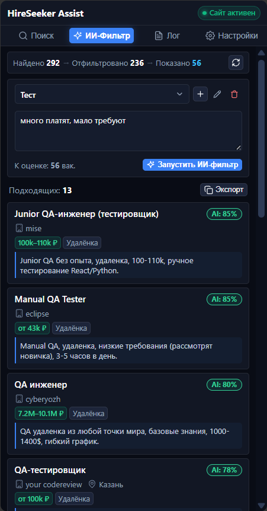

# HireSeeker Assist

<p align="center">
  
</p>

<p align="center">
  <strong>Быстрый поиск, фильтрация и оценка вакансий с помощью нейросетей для hireseeker.ru</strong>
</p>

<p align="center">
  
  
  
  
  
</p>

---

## Что это такое

**HireSeeker Assist** — расширение для браузера Chrome (Manifest V3), которое встраивается в боковую панель браузера и помогает быстро отбирать вакансии с сайта [hireseeker.ru](https://hireseeker.ru/).

Расширение автоматически подтягивает вакансии с сайта, позволяет искать по ключевым словам и фильтровать их с помощью нейросетей (OpenCode Zen, OpenAI, OpenRouter, DeepSeek, Groq, Ollama) по вашему резюме или списку требований.

<p align="center">
  
</p>

---

## Основные возможности

1. **Синхронизация с hireseeker.ru**:
   - Автоматически получает список найденных вакансий при поиске на сайте.
   - Учитывает выбранные фильтры (город, удаленка, зарплата, опыт, источники).
   - Выгружает полный пул вакансий в память расширения.

2. **ИИ-фильтрация вакансий**:
   - Оценивает соответствие вакансий вашим критериям (стек, опыт, локация, стоп-слова).
   - Выводит результат в реальном времени по мере обработки.
   - Показывает процент совпадения и краткую причину решения (почему подходит или отклонено).
   - Поддерживает работу с любыми современными моделями (`gpt-5.6-luna`, `deepseek-v4-flash`, `gpt-4o`, `o3-mini`, `deepseek-r1` и др.) с возможностью настройки Reasoning Effort (`None`, `Low`, `Medium`, `High`, `Max`).
   - Автоматически адаптируется под любые кастомные эндпоинты и модели без Function Calling (прямой JSON-стрим).

3. **Быстрый локальный поиск**:
   - Мгновенный поиск по заголовкам, компаниям, городам, зарплатам и полному тексту описания.
   - Подсветка совпадений и автоматическое исправление раскладки клавиатуры.

4. **Удобный интерфейс**:
   - Работает в боковой панели Chrome (Side Panel).
   - Шаблоны критериев поиска (можно сохранять, редактировать и переключать).
   - Копирование подходящих вакансий в буфер обмена в один клик.
   - Экран с подробными логами запросов и работы расширения.

---

## Схема работы

```text
┌──────────────────────────────────────┐                ┌────────── Background Worker (MV3) ──────────┐
│      Боковая панель (Side Panel)     │ ◄─────RPC─────►│  ├── Приём и хранение вакансий              │
│                                      │                │  ├── Запросы к LLM (пакеты и потоки)        │
│  ├── Поиск (быстрый фильтр)          │                │  └── Управление состоянием и настройками    │
│  ├── ИИ-Фильтр (оценка по резюме)    │                └─────────────────────────────────────────────┘
│  ├── Лог (история работы)            │                                ▲
│  └── Настройки (LLM и скорость)      │                                │ Сообщения
└──────────────────────────────────────┘                                ▼
                                                        ┌────────── Content Script ───────────────────┐
                                                        │  ├── Синхронизация фильтров со страницы     │
                                                        │  └── Бейджи с оценкой на карточках сайта    │
                                                        └─────────────────────────────────────────────┘
```

---

## Структура проекта

```text
hireseeker-assist/
├── assets/                       # Иконки и изображения расширения
├── dist/                         # Готовая сборка для установки в браузер
├── src/
│   ├── core/                     # Логика: API, ИИ-фильтр, промпты, клиент LLM, поиск
│   ├── background/               # Фоновый воркер Chrome Manifest V3
│   ├── content.ts                # Скрипт для страницы hireseeker.ru
│   ├── panel/                    # Интерфейс боковой панели (React 19 + Zustand)
│   └── types/                    # Описания типов TypeScript
├── tests/                        # Тесты (Vitest)
├── manifest.json                 # Манифест расширения
└── package.json
```

## Установка в браузер

1. Скачайте готовый архив `hireseeker-assist-v*.zip` из раздела **[Releases](../../releases)**.
2. Распакуйте скачанный zip-архив в удобную папку на компьютере.
3. Откройте в Chrome страницу управления расширениями: `chrome://extensions/`.
4. Включите переключатель **«Режим разработчика»** (*Developer mode*) в правом верхнем углу.
5. Нажмите кнопку **«Загрузить распакованное расширение»** (*Load unpacked*) и выберите распакованную папку.
6. Нажмите на иконку расширения в панели браузера или откройте боковую панель.

---

## Для разработчиков

Если вы хотите собрать расширение из исходного кода самостоятельно:

```bash
# 1. Установка зависимостей
npm install

# 2. Сборка проекта (файлы появятся в папке dist/)
npm run build

# 3. Запуск тестов
npm test

# 4. Проверка типов TypeScript
npm run typecheck
```

---

## Конфиденциальность

- API-ключи и сохранённые критерии хранятся только локально в браузере (`chrome.storage.local`).
- Запросы к нейросетям отправляются напрямую с вашего компьютера на указанный вами адрес API без промежуточных серверов.

---

## Лицензия

MIT License © 2026